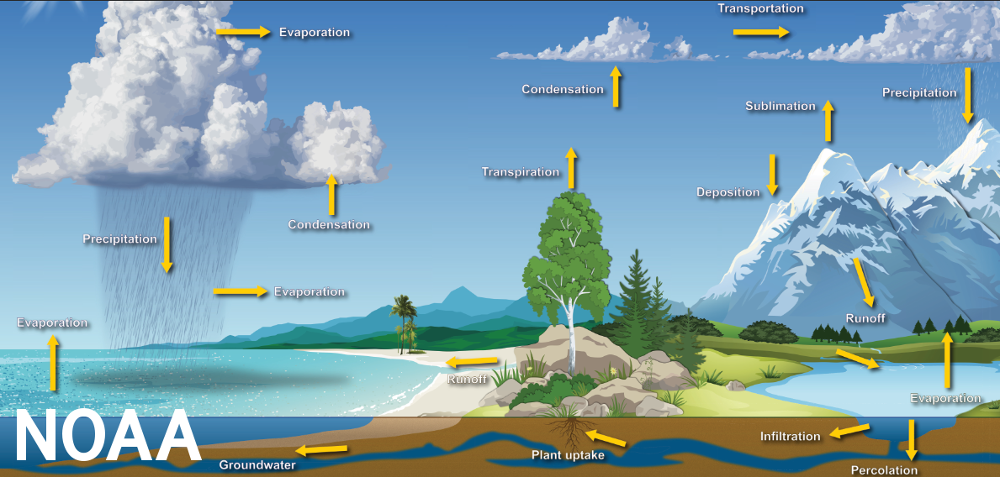

# RiverAnalysis
A page hosting work for local river analysis

# [Project One: Using USGS REST API services to collect, organize, and relate downstream and upstream river gauges.](https://andrewpark467.github.io/RiverAnalysis/)
- This is based on basic hydrology where: In == Out.
- The purpose is to understand downstream response to precipitation. This will aid in understanding timelag for the downstream gauge to "feel" rainfall. 

## Simply put... *when can I expect the best river response for the surf wave at my local whitewater park*?

Lets start by looking at the water cycle.

But I only care about precipitation, so we can essentially ignore everything and only focus on that portion of the water life cycle.
Where OUT is the CFS measured at station 10137000, at the white water park
And IN is the combined runoff/addition from the upstream portions of this problem
Ogden park is Station 10137000 

### Ogden Park = (Station 1) + (Station 2)  + (Precip)

#Now, my favorite part; finding data. 
Where can we find data?
Well, we know that we need precipitation measurements, and river data. 
We also want to use python and requests to perform API calls to save data locally. 
- [So lets use Synoptic data for surface observation collection](https://developers.synopticdata.com/mesonet/)
- [And the USGS REST Service](https://waterservices.usgs.gov/)
