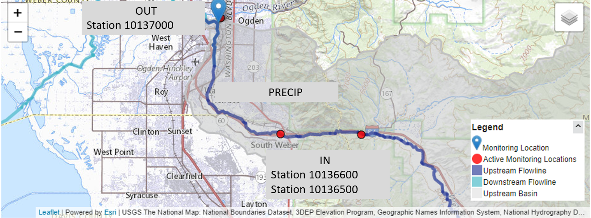
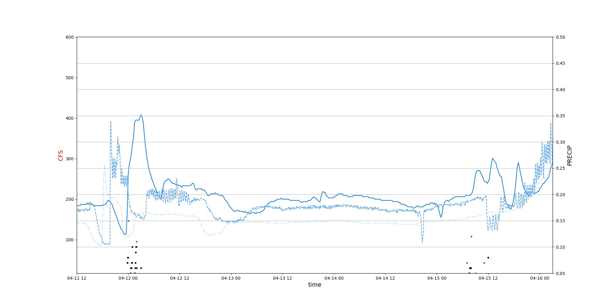

# RiverAnalysis
A page hosting work for local river analysis

# [Project One: Using USGS REST and Synoptic API services to collect, organize, and relate downstream response to upstream impacts.](https://andrewpark467.github.io/RiverAnalysis/)
[See YouTube Video I made requesting data from USGS REST API](https://www.youtube.com/watch?v=pjVDZEw2EsQ&t=970s)

- This is based on basic hydrology where: In == Out.
- The purpose is to understand downstream response to precipitation. This will aid in understanding timelag for the downstream gauge to "feel" rainfall. 

## Simply put... *when can I expect the best river response for the surf wave at my local whitewater park*?


Lets start by looking at the water cycle.


But I only care about precipitation, so we can essentially ignore everything and only focus on that portion of the water life cycle.
Where OUT is the CFS measured at station 10137000, at the white water park
And IN is the combined runoff/addition from the upstream portions of this problem
Ogden park is Station 10137000 

### Simple Equation 1, Out = In :
- Ogden Park = (Station 1) + (Station 2)  + (Precip)





# Now, my favorite part.... finding data!

Well, we know that we need precipitation measurements, and river data. 
We also want to use python and requests to perform API calls to save data locally. 
- [So lets use Synoptic data for surface observation collection](https://developers.synopticdata.com/mesonet/)
- [And the USGS REST Service](https://waterservices.usgs.gov/)

### Example pulling metadata info for stations in the area using Synoptic API
```
#def mesoNetInfo():
def metaData_info():
    url = "https://api.synopticdata.com/v2/stations/metadata?&token=%s&network=4" % ( myToken() )
    print("Now grabbing MetaData information from UDOT RWIS Network" , url) 
    r = requests.get(url)
    if r.status_code != 200:
        print("response failed... " %s (r.status_code) )
   
    metaData_dictionary = r.json()

    #save rwis json files
    with open('%s/%s.txt' %(data_dir, "rwis_info"), 'w') as outFile:
        json.dump(metaData_dictionary, outFile)
```


### Example for pulling USGS River data with Python requests and saving dictionary return as txt file.

```
def pullData(site,year,fileName):  #Will pull stream info from input of state ex: ut/UT or az AZ NY MT
    """
    Variables and what not on USGS API...
    Site Type   == &siteType=ST where ST == streams
    Site Status == &siteStatus={all | active | inactive}
    format      == &format=json 
    site or sites, can pass 100 stations
    site  == &site=0101012013
    sites == &sites=01202101,012021001,0102012012 Can pass 100 
    
    start and end times....   &startDT=2010-11-22&endDT=2010-11-22 // Full day, from 00:00 to 23:59
    lets input a year into the funciton to grab data from that year, to build informaiton.... 
    year can be an integer, float, or strong
    """

    url = "http://waterservices.usgs.gov/nwis/iv/?&parameterCd=00060&site=%s&startDT=%s-01-01&endDT=%s-01-02&format=json" % (site, year, year)
    
    #lets grab data...
    print("Pulling data from station: %s" %(site))
    r = requests.get(url)
    if r.status_code != 200:
        print("API Request failed, status code: %s" % (r.status_code))
    else:
        print("Status code 200...")
        data = r.json()
    
    print("Now saving json dictionary as file:%s/%s.txt  " % (main, fileName))
    with open("%s/%s.txt" % (main, fileName), "w+" ) as outFile:
        json.dump(data, outFile)
```

# Now, keeping it simple and showcasing what the groomed data looks like
 

